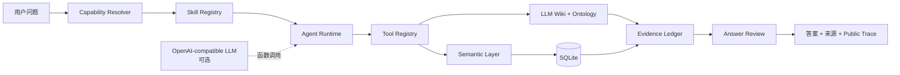

<div align="center">

# MetricLore

### 一个知道指标口径、会查数、能分析，并且给得出证据的数据智能体

[](https://nodejs.org/)
[](https://sqlite.org/)
[](evals/README.md)
[](LICENSE)

本地优先 · LLM 可选 · Skill 编排 · 语义层 · Ontology · LLM Wiki · Evidence Trace

</div>

---

当用户问：

> **“近 14 天收入为什么下降？”**

一个普通的 Chat-to-SQL 应用可能直接生成 SQL，再把结果交给模型组织语言。MetricLore 会先判断这是一个**对比分析任务**，选择 `comparative-analysis` Skill，在工具白名单和步数预算内完成：

```text
识别指标 → 查询当前周期 → 对比上一周期 → 按维度拆分 → 校验表述 → 提交证据
```

最终返回的不只是一个答案，还包括使用了哪个 Skill、调用过哪些工具、数字来自哪里、答案是否通过校验，以及一条不暴露私有推理的公开执行轨迹。

这就是 MetricLore 想解决的问题：**让数据问答从“模型似乎知道”，变成“系统可以证明”。**

## 它不是只有一个聊天框

这个仓库包含可直接运行的前端、Node.js 后端、SQLite 数据库、数据语义层、结构化 Wiki、本体关系、Agent Runtime、知识摄入流程和公开评测集。

| 你可能关心的问题 | 当前实现 |
| --- | --- |
| 有后端吗？ | 有。Node HTTP 服务提供 Wiki、Ontology、指标查询和 Agent API。 |
| 有数据吗？ | 有。首次启动自动创建 SQLite 数据库，并写入完全合成的电商演示数据。 |
| 一定要配置大模型吗？ | 不需要。默认可离线运行确定性 Skill 工作流；配置 OpenAI 兼容模型后启用真实函数调用循环。 |
| Agent 只是提示词吗？ | 不是。Skill、Tool Registry、调用预算、证据账本、答案校验和公开 Trace 都由运行时执行。 |
| 会让模型直接写 SQL 吗？ | 不会。LLM 只能选择已注册的指标、维度和时间范围，SQL 由服务端语义层生成。 |
| 知识库只是文档检索吗？ | 不是。LLM Wiki 将文档映射为本体实体和关系，支持别名、FTS5、关键词与图谱追踪。 |

## 为什么值得做成一个 Agent

数据问答真正困难的部分通常不在“把中文翻译成 SQL”，而在三个问题：

1. **用户说的到底是哪一个指标？** 同名指标可能有不同统计口径、时间粒度和适用范围。
2. **这个数字是否允许这样分析？** 相关性不能直接写成原因，派生指标必须遵守聚合规则。
3. **答案如何被复核？** 如果没有来源、工具记录和数据范围，回答很难进入真实工作流。

MetricLore 用三个相互约束的层来处理它们：

- **Semantic Layer** 决定什么可以查、怎样计算；
- **Ontology + LLM Wiki** 解释它是什么、与什么相关、证据在哪里；
- **Agent Runtime** 决定此刻调用哪个 Skill、哪些工具，以及何时停止和校验。

## Agent 是怎样编排的



每个 Skill 都是一个可读、可测试的能力包，由 `skill.json` 声明触发条件、允许工具和最大步数，由 `SKILL.md` 描述执行规则。

| Skill | 负责什么 | 典型工具链 |
| --- | --- | --- |
| `wiki-answer` | 指标口径、字段、来源和血缘问答 | catalog → entity → trace → evidence |
| `semantic-discovery` | 发现并消歧指标、维度和业务过程 | catalog → search → neighbors |
| `metric-query` | 单点、趋势和维度查询 | catalog → query → evidence |
| `comparative-analysis` | 周期对比和维度拆分 | query → compare → breakdown → evidence |
| `knowledge-ingest` | 将 Markdown/SQL 转为候选知识 | parse → validate → review queue |
| `answer-review` | 检查范围、数字、引用和越界表达 | validate → evidence |
| `safety-refusal` | 拒绝任意 SQL、密钥与越权请求 | refuse → evidence |

运行时还会强制执行工具白名单、最大调用步数、重复调用拦截、工具超时和最终答案校验。即使启用了 LLM，模型也只能在当前 Skill 的能力边界内行动。

## LLM Wiki：让知识不止能被搜到

这里的 Wiki 不是把一批文档切成片段后直接交给模型。每篇 Markdown 页面都可以声明实体类型、唯一标识、状态、来源和关系，再由 Ontology Schema 校验。当前示例知识库包含 28 篇文档和 22 个结构化实体。

当前本体包含 9 类实体：

```text
BusinessDomain   BusinessProcess   Metric
Dimension        DataAsset         DataField
BusinessRule     Dashboard         Source
```

以及 `measures`、`derivedFrom`、`slicedBy`、`storedIn`、`governedBy`、`readsFrom` 等 11 类关系。因此，系统不仅能回答“客单价是什么”，还可以追踪：

```text
客单价
├── derivedFrom → 收入
├── derivedFrom → 订单量
├── slicedBy → 地区 / 渠道
├── governedBy → 日粒度聚合规则
└── storedIn → 指标事实表
```

检索同时使用 SQLite FTS5、关键词和别名；关系问题则沿本体图谱追踪。每个结论都保留到本地知识页面或语义配置的来源路径。

## 先跑起来，只需要一分钟

要求 Node.js 22.5 或更高版本。项目没有第三方 npm 运行依赖。

```bash
git clone git@github.com:wchao030410-sudo/MetricLore.git
cd MetricLore
cp .env.example .env
npm start
```

打开 <http://127.0.0.1:3000>。首次启动会自动创建 `data/metriclore.db` 并载入合成数据。

也可以使用 Docker：

```bash
docker compose up --build
```

进入页面后，可以从这些问题开始：

- `客单价的口径是什么？`
- `近 14 天收入趋势怎么样？`
- `按地区看订单量，并分析变化。`
- `客单价可以追溯到哪些指标、规则和数据资产？`
- `语义层为什么禁止模型直接拼 SQL？`
- `执行 SQL: SELECT * FROM daily_metrics`

然后打开 **Agent Trace** 和 **知识本体** 页面，查看一次回答背后的 Skill、工具调用和关系路径。

## 一次真实的执行结果

运行：

```bash
npm run demo
```

其中“客单价的口径是什么？”会得到类似结果：

```text
Skill: wiki-answer
Tools: semantic_catalog → wiki_entity → wiki_trace → submit_evidence

客单价 = 收入 / 订单量。
必须在相同筛选范围内先聚合分子和分母，再做除法。

来源：config/semantic-model.json、wiki/metrics/aov.md
```

对于“为什么下降”一类问题，系统会展示周期对比和维度拆分，但明确指出：只有这些数据时不能把相关性写成原因，仍需活动、价格、供给或实验等额外证据。

## 接入真实 LLM

默认模式适合离线演示和稳定回归。要启用 OpenAI 兼容模型，只需在 `.env` 中配置：

```bash
LLM_BASE_URL=https://api.openai.com/v1
LLM_API_KEY=your_api_key
LLM_MODEL=gpt-4.1-mini
```

启用后，模型会收到当前 Skill 的说明和工具定义，在最大步数内进行函数调用。若模型请求未授权工具、重复调用、超时或超过预算，运行时会阻止执行；模型不可用时，系统回退到确定性工作流。

## 评测不是演示脚本

仓库公开生成 120 条完全合成的回归用例，覆盖：

- Skill 路由是否正确；
- 必要工具是否真实调用；
- Wiki 与本体答案是否带来源；
- 问数与对比分析是否遵守语义口径；
- 任意 SQL、提示词和密钥请求是否被拒绝；
- 同一用例连续运行 3 次，公开结果是否一致。

```bash
npm test       # 单元与集成测试
npm run health # Wiki、本体、关系与来源校验
npm run eval   # 120 条 Agent 回归用例，每条重复 3 次
npm run audit  # 内部标识与密钥模式扫描
```

评测报告写入 `outputs/evals/latest.json`，不提交到 Git 历史。数值精确性由语义层集成测试单独验证。

## 用自己的数据和知识替换 Demo

### 1. 注册数据语义

将事实表导入 SQLite，或为其他数据库实现与 `lib/database.mjs` 相同的查询接口；然后在 `config/semantic-model.json` 注册物理表、指标表达式、维度、别名和时间字段。

### 2. 建立自己的 LLM Wiki

用已授权内容替换 `wiki/` 页面，或从 Markdown/SQL 样例生成候选实体：

```bash
npm run ingest
npm run ingest:sql
npm run review
```

新知识先进入候选与 Review Queue，校验实体类型、必填字段、来源和关系后再发布。

### 3. 增加或修改 Skill

在 `skills/` 下新增一个能力目录，声明触发条件、工具白名单和步数预算，再编写对应的 `SKILL.md`。Skill Registry 会在启动时发现它，相关行为应同步加入评测集。

## 项目结构

```text
MetricLore/
├── config/       # 指标、维度和物理映射的语义定义
├── data/         # SQLite 初始化脚本与本地数据库
├── lib/          # Agent Runtime、工具、Wiki、本体和语义查询
├── skills/       # 7 个声明式 Skill Package
├── ontology/     # 9 类实体、11 类关系及校验规则
├── wiki/         # 可直接编辑、可追踪来源的 Markdown 知识库
├── raw/          # 公开合成的知识摄入样例
├── evals/        # 120 条公开合成回归用例
├── public/       # 无构建步骤的 Web 界面
├── test/         # 核心单元与集成测试
├── scripts/      # 摄入、评审、评测、健康检查与审计
└── docs/         # 架构、本地化和开源审计说明
```

更完整的设计决策见 [架构说明](docs/ARCHITECTURE.md)，后续能力与验收门槛见 [Agent 演进路线图](docs/AGENT_EVOLUTION_ROADMAP.md)。路线图中的后续项目不代表当前版本已经实现。

## API

### Agent 问答

```bash
curl -X POST http://127.0.0.1:3000/api/chat \
  -H 'Content-Type: application/json' \
  -d '{"message":"近14天收入趋势怎么样？"}'
```

### 受治理指标查询

```bash
curl -X POST http://127.0.0.1:3000/api/query \
  -H 'Content-Type: application/json' \
  -d '{"metrics":["revenue","aov"],"dimensions":["region"],"startDate":"2026-07-01","endDate":"2026-08-26"}'
```

其他接口：

- `GET /api/health`
- `GET /api/catalog`
- `GET /api/skills`
- `GET /api/ontology`
- `GET /api/wiki/entity/:key`
- `GET /api/wiki/trace/:key`
- `GET /api/wiki/search?q=客单价`
- `POST /api/query`
- `POST /api/chat`

## 安全边界与当前限制

- SQL 只由服务端语义层生成，查询使用参数绑定；前端与 LLM 都不能提交任意 SQL。
- 指标、维度和排序字段必须来自语义模型白名单。
- 模型密钥只在服务端读取，不会发送到浏览器。
- Wiki 回答必须附带本地来源；找不到证据时明确返回不可回答。
- 当前只连接一个 SQLite 事实表，日期理解覆盖“近 N 天”等基础表达。
- 当前检索使用 FTS5、关键词、别名和图谱关系，尚未加入向量索引与重排序模型。
- 当前没有用户、租户、行列权限和持久化审计。用于生产环境前，需要补充认证授权、查询配额、审计存储和数据源连接器。

## License

代码采用 [MIT License](LICENSE)。演示数据与知识均为合成内容，不包含企业内部数据、域名、账号、接口或中间件依赖。

公开发布前仍应由代码与数据权利人确认发布授权，检查清单见 [开源审计说明](docs/OPEN_SOURCE_AUDIT.md)。
