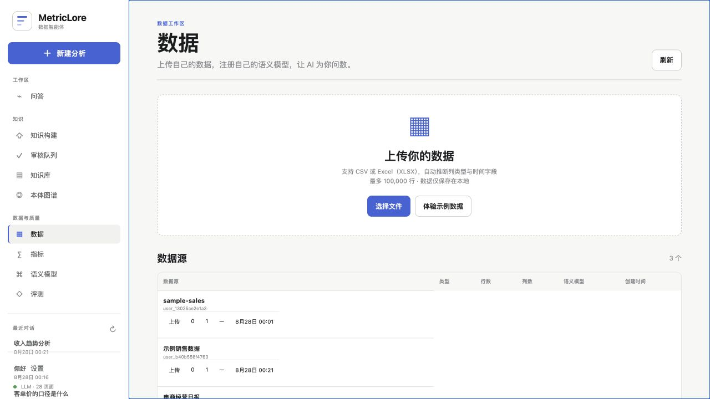
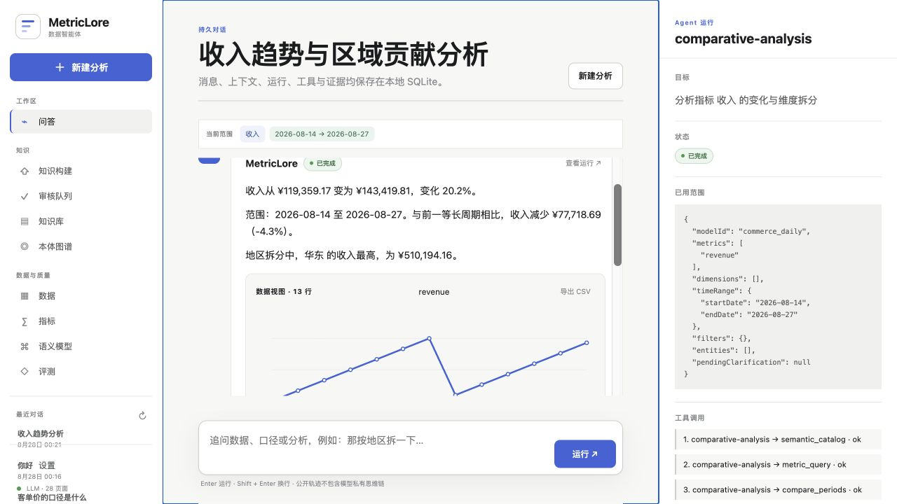
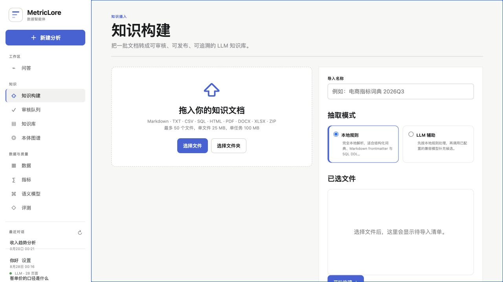
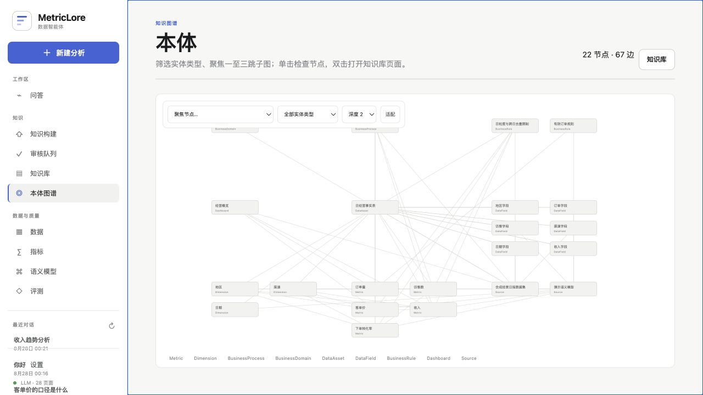
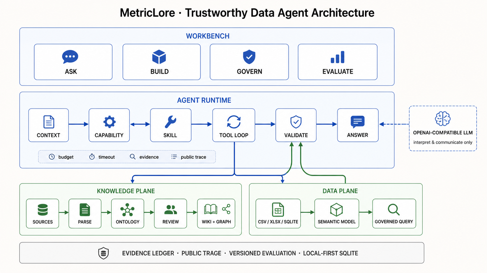
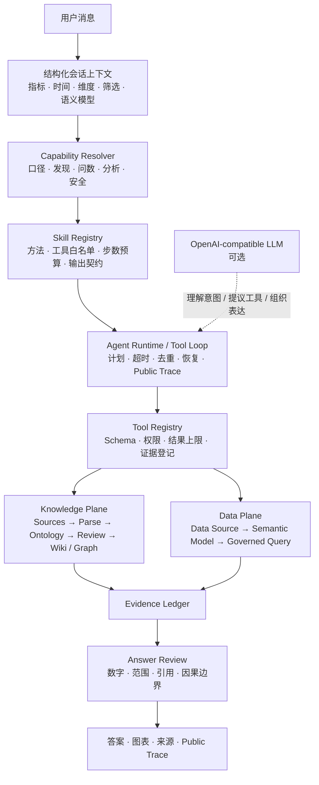

<div align="center">

# MetricLore

### 面向数据与知识治理的可信 Agent 工作台

把数据接入、语义建模、知识治理、Agent 编排与版本化评测放进同一条产品闭环，\
让每一次回答都**有口径、有证据、可追踪、可验证**。

[](CHANGELOG.md)
[](package.json)
[](#评测与质量)
[](LICENSE)

**Build the knowledge. Govern the data. Trace every answer.**

[快速开始](#快速开始) · [产品闭环](#产品闭环) · [系统架构](#系统架构) · [Agent 编排](#agent-编排设计) · [评测与质量](#评测与质量)

</div>

<p align="center">
  
</p>
<p align="center"><sub>数据工作区：上传 CSV / Excel，注册语义模型，让 Agent 在受治理的指标边界内问数。</sub></p>

MetricLore 是一个本地优先的数据智能体工作台。它不是给数据库套一层聊天框，也不把“写一段更长的 Prompt”当作治理方案；它试图回答一个更难的问题：**如何让一个会使用数据和知识的 Agent 值得信任？**

为此，MetricLore 将知识构建、指标语义、多轮上下文、Skill / Tool 编排、人工审核、证据账本与版本化评测组织为一套可运行的产品系统。用户可以接入自己的数据和文档，用自然语言连续问数与分析，并在同一条消息里查看答案、图表、来源、查询范围和公开执行轨迹。

> 当前版本：`v0.3.1`。默认可离线运行确定性工作流；配置 OpenAI-compatible 模型后，模型参与意图理解、工具选择与有证据的表达，但不会获得任意 SQL 或绕过治理边界的数据访问权。

## 为什么做 MetricLore

数据 Agent 的难点从来不只是“模型能不能回答”，而是：回答使用了哪个口径、访问了什么范围、调用了哪些能力、结论由什么证据支持，以及升级后是否仍然可靠。

| 关键问题 | 常见捷径 | MetricLore 的设计 |
| --- | --- | --- |
| 模型应该做什么？ | 把所有能力写进一个 Prompt | 先识别 Capability，再选择带工具白名单和预算的 Skill |
| 模型如何访问数据？ | 直接生成并执行 SQL | 只能选择已注册指标、维度、时间与筛选；SQL 归语义层所有 |
| 口径从哪里来？ | 依赖模型记忆或聊天上下文 | Wiki、本体、语义模型分别治理，回答时合流并附来源 |
| 多轮追问如何连续？ | 重放完整聊天历史 | 结构化保存指标、时间、维度、筛选和语义模型状态 |
| 如何知道答案可信？ | 只展示最终文本 | 同时展示数据范围、证据账本、工具调用和 Public Trace |
| 如何安全地持续迭代？ | 靠人工抽查 Demo | 固化单轮、多轮、知识、数据准确率与 LLM Judge 评测 |

## 产品闭环

MetricLore 把一个数据 Agent 拆成五个相互约束、可以独立验证的工作区，而不是一组互不相干的功能页面。

| 阶段 | 用户任务 | 系统职责 | 信任机制 |
| --- | --- | --- | --- |
| **Data** | 上传 CSV / XLSX，创建数据源 | 推断列类型与角色，注册本地物理表 | 行数限制、列名清洗、引用保护、本地存储 |
| **Build** | 导入指标词典、SQL、制度或业务文档 | 解析、分段、实体抽取、本体校验、冲突检测 | 来源定位、候选状态、已验证知识保护 |
| **Govern** | 审核知识，维护指标与语义模型 | 编辑、合并、批准、驳回、版本化发布 | Human-in-the-loop、Schema、版本与血缘 |
| **Ask** | 连续问口径、数值、趋势与拆分 | 继承上下文，选择 Skill，调用受治理工具 | 澄清优先、证据账本、回答校验、公开轨迹 |
| **Evaluate** | 运行质量门禁，回看历史结果 | 快照评测集、知识和语义模型并执行五类套件 | 可回溯版本、确定性回归、独立 Judge 模型 |

### 产品界面

<table>
  <tr>
    <td width="50%">
      <strong>Agent 分析与公开轨迹</strong><br>
      <sub>答案、图表、实际范围、工具调用、证据和校验状态同屏呈现。</sub><br><br>
      
    </td>
    <td width="50%">
      <strong>知识构建</strong><br>
      <sub>从原始文档进入解析、抽取、校验、审核和发布流水线。</sub><br><br>
      
    </td>
  </tr>
  <tr>
    <td colspan="2">
      <strong>本体图谱</strong><br>
      <sub>用实体与关系连接指标、维度、规则、字段、数据资产、业务过程和来源。</sub><br><br>
      
    </td>
  </tr>
</table>

## 系统架构

<p align="center">
  
</p>

架构遵循一条硬边界：**LLM 负责理解、选择和表达；确定性代码负责执行、约束和验证。** 模型不能直接访问数据库或 Wiki 文件，只能在 Agent Runtime 选定的 Skill 范围内提出工具调用；Tool Registry、Semantic Layer 和 Knowledge Plane 执行真正的读取与计算。



### 两条治理平面

- **Knowledge Plane**：原始资料经过解析、实体抽取、本体 Schema 校验、冲突检测和人工审核后，才进入 Wiki、FTS 索引和图谱。自动抽取只生成候选，不会覆盖已验证知识。
- **Data Plane**：每个语义模型绑定一张事实表并声明指标、维度、时间字段与别名。Agent 只能提交语义查询参数，服务端生成白名单化、参数绑定的 SQL。
- **Evidence Plane**：知识来源、查询范围、工具结果和校验状态被统一登记，为回答、Public Trace 与评测快照提供同一份可验证依据。

## Agent 编排设计

### 一条消息的生命周期

```text
RECEIVED
  → 继承结构化会话上下文
  → RESOLVING_CAPABILITY
  → SELECTING_SKILL
  → 生成公开任务计划
  → RUNNING_TOOL × N
  → COLLECTING_EVIDENCE
  → VALIDATING
  → COMPLETED | NEEDS_CLARIFICATION | NOT_ANSWERABLE | FAILED
```

以“华东为什么变化？”为例，系统不会直接让模型自由分析：

```text
上下文   收入 · 近 14 天 · 地区 · 华东 · commerce_daily
能力     comparative-analysis
Skill    comparative-analysis
计划     semantic_catalog → metric_query → compare_periods
         → dimension_breakdown → submit_evidence → validate_answer
输出     变化描述 + 维度拆分 + 证据边界 + Public Trace
```

### 分层职责

| 层 | 负责 | 明确不负责 |
| --- | --- | --- |
| **LLM** | 理解自然语言、处理歧义、提出允许的工具调用、组织有证据的表达 | 任意 SQL、权限判断、直接读库、凭记忆补口径 |
| **Skill** | 定义任务方法、允许工具、执行顺序、步数预算和输出契约 | 绕过 Tool 直接访问数据 |
| **Agent Runtime** | Capability 解析、计划、工具循环、超时、重复调用拦截、恢复与轨迹 | 暴露模型私有思维链 |
| **Tool Registry** | JSON Schema、工具权限、结果大小、统一信封和证据登记 | 接受未声明参数或跨 Skill 调用 |
| **Semantic Layer** | 指标/维度白名单、派生指标、日期粒度、参数化 SQL | 接受任意 SQL 或未注册字段 |
| **Human Review** | 判断候选知识是否合并、批准、驳回与发布 | 把自动抽取结果无条件上线 |

### 七个内置 Skill

| Skill | 用途 | 关键边界 |
| --- | --- | --- |
| `wiki-answer` | 指标口径、规则、字段、来源与血缘 | 没有来源时不补全事实 |
| `semantic-discovery` | 发现指标、维度、业务对象并消歧 | 相似指标不自动混用 |
| `metric-query` | 单值、趋势、维度拆分与受控问数 | 不接收任意 SQL，不做原因归因 |
| `comparative-analysis` | 周期对比、贡献拆分与待验证假设 | 相关性不写成确定因果 |
| `knowledge-ingest` | 把资料转为候选实体与关系 | 未审核内容不能发布 |
| `answer-review` | 检查数字、范围、引用和表达边界 | 不引入新数据或新结论 |
| `safety-refusal` | 拦截密钥、任意 SQL、注入与越界请求 | 安全请求不进入工具执行 |

## 核心能力

### 接入自己的数据

- 上传 CSV 或 Excel，自动推断数值、文本、日期类型与时间 / 维度 / 度量角色。
- 基于数据表创建语义模型，注册原子指标与派生指标；同名指标在不同模型中保持独立口径。
- Agent 跨语义模型识别指标：唯一命中时自动路由，跨模型歧义时先澄清。
- 用户数据仅保存在本地 SQLite；被语义模型引用的数据源受删除保护。

### 构建自己的知识库

- 支持 Markdown、TXT、CSV、SQL、HTML、PDF、DOCX、XLSX、文件夹与 ZIP。
- 流程覆盖解析、分段、实体抽取、本体校验、重复 / 冲突检测、人工审核和版本化发布。
- 保留文件、页码、章节、工作表等来源定位；发布后 Wiki、检索索引和图谱热更新。
- 可选择完全本地规则抽取，或在明确传输边界后启用 LLM 辅助抽取。

### 连续问数与分析

- 上下文以结构化状态跨轮继承，而不是只依赖聊天历史。
- 结果同时提供趋势图、可排序数据表、实际查询范围、来源和导出能力。
- 指标口径可以沿本体关系追溯到计算方式、分子分母、维度、字段、规则和来源。
- 证据不足时停止归因；不明确时暂停并澄清；模型不可用时切换到确定性编排。

## 评测与质量

评测是产品能力，不是发布前临时跑一次的脚本。每次运行会保存**评测集版本、知识内容与发布版本、语义模型**三类快照，从而支持历史回溯和回归对比。

| 套件 | 衡量什么 | 核心口径 |
| --- | --- | --- |
| 单轮 Agent 回归 | Capability、Skill 与 Tool 路由 | 通过率、三次一致率、平均 / P95 耗时 |
| 多轮上下文 | 结构化上下文继承与会话隔离 | 上下文准确率、隔离率 |
| Wiki Builder 闭环 | 摄入、审核、发布、检索与引用 | 专项检查通过率 |
| 数据准确率 | 语义查询是否等于独立重算 | 数值准确率、查询耗时 |
| LLM-as-a-Judge | 知识回答质量 | 正确性、忠实性、完整性、引用质量 |

确定性套件固定关闭 LLM，用于稳定回归；只有 Judge 套件调用单独配置的裁判模型，避免路由和数值正确性被模型随机性掩盖。

```bash
npm test                 # 代码与集成测试
npm run health           # Wiki / 本体 / 语义层健康检查
npm run eval             # 120 条单轮 Agent 回归
npm run eval:multi-turn  # 30 组多轮对话
npm run eval:wiki        # Wiki Builder 闭环
npm run eval:data        # 独立重算的数据准确率
npm run eval:judge       # LLM-as-a-Judge
npm run audit            # 开源敏感信息审计
```

完整门禁：

```bash
npm run verify
```

## 快速开始

运行环境：Node.js `22.13+`。应用使用本地 SQLite，不要求单独安装数据库。

```bash
git clone https://github.com/wchao030410-sudo/MetricLore.git
cd MetricLore
cp .env.example .env
npm ci
npm start
```

打开 <http://127.0.0.1:3000>。首次启动会自动创建本地数据库并载入 90 天电商合成数据。

### 两种运行模式

| 模式 | 是否需要 Key | 能力边界 |
| --- | --- | --- |
| **Deterministic** | 否 | 受控问数、口径、知识检索和基础分析完整可用 |
| **LLM-enhanced** | 是 | 增强自然语言理解、工具选择、知识抽取和有证据表达 |

支持任意 OpenAI-compatible 端点。编辑 `.env` 后重启服务：

```bash
# 以 DeepSeek 为例；请替换成你自己的密钥
LLM_BASE_URL=https://api.deepseek.com/v1
LLM_API_KEY=sk-你的密钥
LLM_MODEL=deepseek-v4-flash
```

> 不要提交 `.env` 或真实密钥。模型 Key 只在服务端读取，不会发送到浏览器。

### 建议体验路径

1. 在「数据」页点击「体验示例数据」，或上传自己的 CSV / XLSX。
2. 基于数据源创建语义模型并注册第一个指标。
3. 在「问答」中依次提问：`近 14 天收入怎么样？` → `那按地区拆一下。` → `华东为什么变化？` → `这个指标口径是什么？`。
4. 展开消息内的 Execution，检查 Skill、工具、查询范围、证据和校验状态。
5. 在「知识构建」导入示例资料，进入「审核队列」批准并发布，再回到问答验证新知识。
6. 在「评测」页运行质量门禁，查看版本快照与历史结果。

仓库提供两套知识构建示例：[`ecommerce-growth`](examples/wiki-builder/ecommerce-growth) 与 [`subscription-saas`](examples/wiki-builder/subscription-saas)。

## 安全与信任边界

- LLM、前端和上传内容都不能提交任意 SQL。
- 指标、维度、排序与筛选字段必须来自语义模型白名单。
- 查询使用参数绑定；Skill 只暴露当前任务允许的 Tool。
- Public Trace 只记录公开计划、参数摘要、工具结果与证据，不展示模型私有思维链。
- 上传包含数量、大小、路径深度、ZIP 解压体积和压缩比限制；HTML 摄入移除脚本与外部资源。
- 数据和知识默认保存在本地；只有显式启用 LLM 的能力会把所需上下文发送到配置的兼容端点。

安全策略与漏洞报告方式见 [`SECURITY.md`](SECURITY.md)。

## 项目结构

```text
public/                     无构建步骤的 Agent Workbench 前端
server.mjs                  HTTP API、SSE 与静态资源入口
lib/agent-runtime.mjs       Capability、计划、工具循环与 Public Trace
lib/skill-registry.mjs      声明式 Skill 发现与能力边界
lib/tool-registry.mjs       受治理工具、Schema 与证据登记
lib/semantic-layer.mjs      多语义模型、指标白名单与参数化查询
lib/ingest/                 解析、抽取、校验、审核与发布
lib/evaluation-service.mjs  评测集、快照、后台运行与历史
skills/                     七个 Skill Package
ontology/                   实体、关系与 Schema
wiki/                       已发布的可追溯知识页
evals/                      单轮、多轮与知识质量用例
test/                       单元、集成与端到端测试
docs/                       架构、API、迭代计划与审计说明
```

## 当前边界与演进方向

当前版本面向本地、单工作区、单用户场景，优先保证闭环可运行、行为可解释、结果可评测。

- 每个语义模型当前绑定一张 SQLite 事实表；后续可扩展 DuckDB、PostgreSQL / MySQL 与企业数据连接器。
- 检索使用 SQLite FTS5、关键词、别名与图谱关系；向量检索和重排序仍是增强项。
- 自然语言时间识别以“近 N 天”等基础范围为主，更复杂日历语义仍需扩展。
- 身份认证、多租户、行列权限、查询配额和独立审计系统属于企业化阶段。
- 更深的分析诊断需要额外业务证据与实验设计，不会由当前系统仅凭相关性自动下结论。

完整规划见 [`V0.3_ITERATION_PLAN.md`](docs/V0.3_ITERATION_PLAN.md) 与 [`AGENT_EVOLUTION_ROADMAP.md`](docs/AGENT_EVOLUTION_ROADMAP.md)。

## 文档

- [系统架构](docs/ARCHITECTURE.md)
- [API 与 SSE 事件](docs/v0.2/API_AND_EVENTS.md)
- [数据模型](docs/v0.2/DATA_MODEL.md)
- [升级说明](docs/v0.2/UPGRADING.md)
- [开源审计](docs/OPEN_SOURCE_AUDIT.md)
- [贡献指南](CONTRIBUTING.md)

## License

[MIT](LICENSE) © 2026 MetricLore contributors
