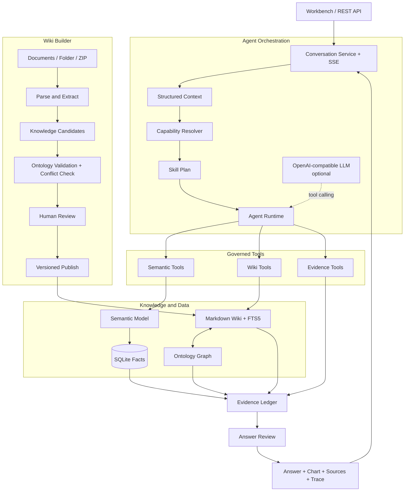

<div align="center">

# MetricLore

### Ontology-grounded Data Agent & Wiki Builder

把散落的业务文档构建成可追溯 Wiki，让 Agent 基于统一口径连续问数、分析和追问。

[](CHANGELOG.md)
[](https://nodejs.org/)
[](https://sqlite.org/)
[](#评测)
[](LICENSE)

**Build the Wiki. Ask the data. Trace the answer.**

</div>

MetricLore 是一个本地优先的数据智能体工作台。它把语义层、知识本体、LLM Wiki 和 Skill 编排放进同一条执行链：用户提交问题，Agent 继承会话上下文、生成公开计划、调用受治理工具，并把答案、图表、来源和运行轨迹保存在同一条消息中。

仓库自带可运行的 Web 界面、Node.js 服务、SQLite 合成数据、Markdown Wiki、9 类本体实体、7 个 Skill Package，以及从文档导入到审核发布的 Wiki Builder。默认的确定性运行模式可离线演示；配置 OpenAI-compatible 模型后启用函数调用循环。

## 可以做什么

| 用户任务 | 系统执行 | 可检查的结果 |
| --- | --- | --- |
| 连续问数 | 继承指标、时间、维度和筛选条件 | 图表、可排序表格、查询范围 |
| 对比分析 | 组合趋势、前期对比和维度拆分 | 变化描述、贡献维度、证据边界 |
| 指标问答 | 读取语义目录、Wiki 页面和本体关系 | 定义、计算规则、来源、血缘路径 |
| Wiki 构建 | 解析 PDF、DOCX、XLSX、CSV、Markdown、SQL、HTML、TXT 和 ZIP | 候选实体、来源定位、校验结果 |
| 知识治理 | 编辑、冲突检测、批量审核、版本化发布 | Review 记录、Wiki 版本、热更新索引 |
| Agent 观测 | 持久化 Plan、Skill、Tool、Evidence 和校验事件 | 消息级 Public Trace、停止与重试 |
| 本体探索 | 遍历 9 类实体与 11 类关系 | 可筛选的知识图谱与双向邻居 |

## 5 分钟体验

运行环境为 Node.js 22.13 或更高版本。

```bash
git clone https://github.com/wchao030410-sudo/MetricLore.git
cd MetricLore
cp .env.example .env
npm ci
npm start
```

打开 <http://127.0.0.1:3000>。首次启动会创建本地 SQLite 数据库，并载入 90 天电商合成数据。

### 跑一次多轮分析

在「智能问答」中依次发送：

```text
近 14 天收入怎么样？
那按地区拆一下。
华东为什么变化？
这个指标口径是什么？
```

四条消息共享同一份结构化上下文。每条回答都拥有独立 Run，可以展开查看 Skill Plan、工具状态、数据范围、Evidence 和校验结果。

### 用自己的文档构建 Wiki

1. 打开「Wiki 构建」。
2. 上传文件、文件夹或 ZIP；第一次体验可直接选择 [`examples/wiki-builder/ecommerce-growth`](examples/wiki-builder/ecommerce-growth) 或 [`examples/wiki-builder/subscription-saas`](examples/wiki-builder/subscription-saas)。
3. 在「审核队列」核对候选内容、来源定位、本体关系和冲突。
4. 批准并发布，在「Wiki 浏览」和「本体图」中查看新知识。
5. 回到「智能问答」，用刚发布的知识继续提问。

Docker 也可以直接启动：

```bash
docker compose up --build
```

## 架构



### 一条消息如何运行

```text
Question    华东为什么变化？
Context     收入 · 近 14 天 · 地区 · 华东
Capability analysis
Skill       comparative-analysis
Plan        semantic_catalog
            → metric_query
            → compare_periods
            → dimension_breakdown
            → submit_evidence
Review      validate_answer
Status      verified
```

`Capability Resolver` 识别知识问答、语义发现、问数、分析和安全请求。`Skill Registry` 提供工具白名单、执行顺序和步数预算。`Agent Runtime` 管理调用、超时、取消、证据归集和回答校验。前端展示这些公开事件，模型私有思维过程不进入事件流。

## Wiki、语义层和本体

### Wiki Builder

Wiki Builder 使用「解析 → 抽取 → 校验 → 审核 → 发布」工作流。每个候选保留文件、页码、章节、行号、工作表或行号定位。发布时生成带 Frontmatter 的 Markdown 页面，记录发布批次和实体版本，并刷新全文检索与图谱索引。

规则抽取可完全在本地执行。`llm_assisted` 模式通过 OpenAI-compatible 接口补充抽取，界面会提示传输范围。

### Semantic Layer

[`config/semantic-model.json`](config/semantic-model.json) 注册指标表达式、聚合方式、维度、别名、时间字段和物理映射。所有问数都经过参数化查询生成器，派生指标使用同一份受治理定义。

### Ontology + LLM Wiki

[`ontology/schema.json`](ontology/schema.json) 定义 `Metric`、`Dimension`、`BusinessProcess`、`BusinessDomain`、`DataAsset`、`DataField`、`BusinessRule`、`Dashboard` 和 `Source`，并约束 11 类关系。

```text
Metric ── measures ───────> BusinessProcess ── occursIn ──> BusinessDomain
Metric ── derivedFrom ────> Metric
Metric ── slicedBy ───────> Dimension
Metric ── storedIn ───────> DataAsset ── contains ────────> DataField
Metric ── governedBy ─────> BusinessRule
Dashboard ── displays ────> Metric
```

Markdown Wiki 负责版本管理和来源追踪；FTS5、关键词、别名和关系图共同完成检索。当前内置示例包含 28 篇文档与 22 个实体。

## Skill Package

每个 Skill 都有机器可读配置和面向执行器的操作说明：

```text
skills/wiki-answer/
├── skill.json   # 触发能力、工具白名单、最大步数
└── SKILL.md     # 执行顺序、证据要求、输出约定
```

| Skill | 用途 | 最大步骤 |
| --- | --- | ---: |
| `wiki-answer` | 指标口径、字段、来源和血缘 | 5 |
| `semantic-discovery` | 指标、维度和业务过程发现 | 4 |
| `metric-query` | 单点、趋势、周期和维度查询 | 5 |
| `comparative-analysis` | 周期对比与维度拆分 | 6 |
| `knowledge-ingest` | 候选知识生成 | 4 |
| `answer-review` | 数字、范围、引用和表达检查 | 2 |
| `safety-refusal` | SQL、密钥和越权请求处理 | 1 |

配置模型：

```bash
LLM_BASE_URL=https://api.openai.com/v1
LLM_API_KEY=your_api_key
LLM_MODEL=gpt-4.1-mini
```

模型负责理解问题、选择已授权工具和组织答案；运行时负责权限、预算、查询执行、证据和校验。模型服务不可用时，确定性工作流会接管已支持的任务。

## 评测

```bash
npm test                 # 单元与集成测试
npm run health           # Wiki、本体、关系和来源健康检查
npm run eval             # 120 条单轮用例，每条重复 3 次
npm run eval:multi-turn  # 30 组、120 轮连续对话
npm run eval:wiki        # 摄入、冲突、引用、发布和索引专项评测
npm run audit            # 密钥与内部标识扫描
npm run verify           # 完整发布门禁
```

当前基线：53 条自动化测试；120 条单轮用例通过率与三次运行一致率 100%；30 组多轮评测上下文准确率与会话隔离率 100%；15 项 Wiki Builder 专项检查全部通过。评测报告写入 `outputs/evals/`。

## 接入自己的数据与知识

1. 将事实数据导入 SQLite，或为目标数据库实现查询适配器。
2. 在 [`config/semantic-model.json`](config/semantic-model.json) 注册指标、维度、别名和物理字段。
3. 通过 Wiki Builder 导入业务文档，审核候选实体和本体关系后发布。
4. 为新增指标、知识和 Skill 添加测试与评测用例。
5. 运行 `npm run verify` 检查完整链路。

## API

主要接口：

```text
POST /api/conversations
POST /api/conversations/:id/messages
GET  /api/conversations/:id/runs/:runId/events

POST /api/knowledge/jobs
GET  /api/knowledge/jobs/:id/candidates
POST /api/knowledge/candidates/:id/review
POST /api/knowledge/jobs/:id/publish

GET  /api/wiki/pages
GET  /api/wiki/pages/:key
GET  /api/wiki/pages/:key/source
GET  /api/wiki/graph

POST /api/query
POST /api/chat
```

完整请求、响应和 SSE 事件契约见 [`docs/v0.2/API_AND_EVENTS.md`](docs/v0.2/API_AND_EVENTS.md)。

## 项目结构

```text
MetricLore/
├── config/       semantic model
├── data/         migrations, SQLite seed and local database
├── examples/     importable Wiki Builder examples
├── evals/        single-turn and multi-turn evaluation sets
├── lib/          orchestration, conversations, tools, wiki and ingestion
├── ontology/     entity and relation schema
├── public/       Agent Workbench
├── scripts/      eval, health, audit and local utilities
├── skills/       declarative Skill Packages
├── test/         unit and integration tests
└── wiki/         versioned business knowledge
```

架构决策见 [`docs/ARCHITECTURE.md`](docs/ARCHITECTURE.md)，v0.2 实施记录见 [`docs/V0.2_ITERATION_PLAN.md`](docs/V0.2_ITERATION_PLAN.md)，版本变化见 [`CHANGELOG.md`](CHANGELOG.md)，从 v0.1 升级见 [`docs/v0.2/UPGRADING.md`](docs/v0.2/UPGRADING.md)。

当前版本面向本地单用户演示与扩展开发。数据库连接器、身份认证、行列权限、查询配额、向量检索和多租户属于后续演进方向。

## License

[MIT](LICENSE) © 2026 MetricLore contributors
