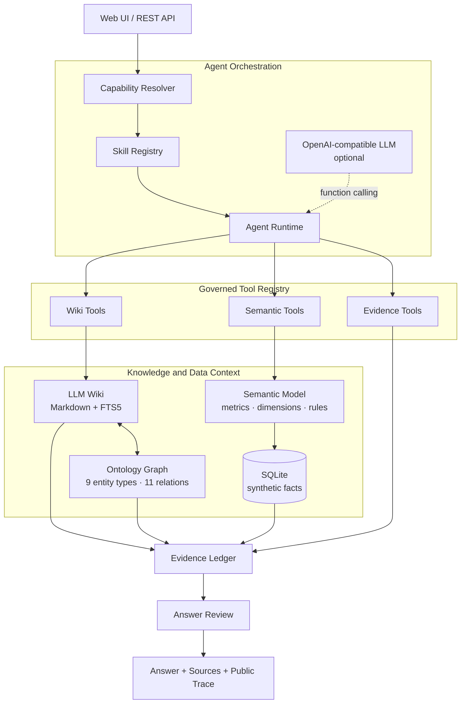

<div align="center">

# MetricLore

### Ontology-grounded data intelligence agent

基于语义层、知识本体和 Skill 编排的数据智能体

[](https://nodejs.org/)
[](https://sqlite.org/)
[](evals/README.md)
[](LICENSE)

**Ask metrics. Run governed analysis. Trace every answer.**

</div>

MetricLore 将指标口径、业务知识和数据查询放进同一条 Agent 工作流。用户用自然语言提问，系统选择对应 Skill，通过语义层查询数据，通过 LLM Wiki 查找业务上下文，最后返回答案、来源和公开执行轨迹。

仓库包含完整的 Web 界面、Node.js 服务、SQLite 合成数据、7 个 Skill Package、Ontology Schema、Markdown Wiki、知识摄入脚本和 120 条 Agent 回归用例。默认模式使用确定性编排，配置 OpenAI-compatible 模型后启用函数调用循环。

## 能力

| 场景 | MetricLore 的处理方式 | 输出 |
| --- | --- | --- |
| 指标口径 | 检索语义目录、Wiki 实体和本体关系 | 定义、计算规则、来源、关系路径 |
| 自然语言问数 | 将指标、维度和时间范围映射到语义模型 | 数据表、统计范围、指标来源 |
| 对比分析 | 组合趋势查询、同期对比和维度拆分工具 | 变化描述、贡献维度、证据边界 |
| 数据发现 | 在指标、维度、业务过程和数据资产中消歧 | 候选实体和图谱邻居 |
| 知识追踪 | 沿 `derivedFrom`、`storedIn`、`governedBy` 等关系遍历 | 指标血缘和知识路径 |
| Agent 观测 | 记录 Skill、工具参数、状态、耗时和来源 | Public Trace 与 Evidence Ledger |
| 知识摄入 | 从 Markdown 和 SQL 提取候选实体 | 校验结果和 Review Queue |

## 一次 Agent 运行

```text
Question    近 14 天收入为什么下降？
Capability analysis
Skill       comparative-analysis
Tools       semantic_catalog
            → metric_query
            → compare_periods
            → dimension_breakdown
            → submit_evidence
Review      validate_answer
Status      verified
```

运行时先确定任务能力，再加载 Skill 的工具白名单和步数预算。数据工具返回当前周期、上一周期和维度拆分结果，答案校验器检查数字、范围、引用和归因措辞，Evidence Ledger 保存本次回答使用的数据与知识来源。

## 架构



### Agent Orchestration

`Capability Resolver` 将问题分为知识问答、语义发现、问数、分析和安全请求。`Skill Registry` 从 `skills/` 加载能力包，`Agent Runtime` 执行工具循环并管理预算、超时、重复调用和状态轨迹。

### Governed Tool Registry

工具使用 JSON Schema 描述输入，宿主统一管理调用范围。Wiki 工具负责搜索、实体读取和图谱遍历；Semantic 工具负责目录发现、指标查询、周期对比和维度拆分；Evidence 工具负责来源归集和答案校验。

### Semantic Layer

`config/semantic-model.json` 保存指标表达式、维度、别名、时间字段和物理映射。服务端根据注册内容生成参数化 SQL，统一处理派生指标和聚合规则。

### Ontology + LLM Wiki

Wiki 页面使用 Markdown 与结构化 Frontmatter 保存业务知识。Ontology Schema 定义 9 类实体和 11 类关系，当前示例包含 28 篇文档与 22 个实体。SQLite FTS5、关键词、别名和图谱关系共同完成检索。

### Answer Review

最终答案经过范围、数字、引用和越界表达检查。分析工作流区分数据变化、维度贡献和因果证据，把待验证因素保留为分析线索。

## 快速开始

运行环境：Node.js 22.5 或更高版本。项目使用 Node.js 内置模块，启动过程无需安装第三方 npm 依赖。

```bash
git clone git@github.com:wchao030410-sudo/MetricLore.git
cd MetricLore
cp .env.example .env
npm start
```

打开 <http://127.0.0.1:3000>。首次启动会创建 `data/metriclore.db` 并载入电商合成数据。

Docker 启动：

```bash
docker compose up --build
```

可以从这些问题开始：

```text
客单价的口径是什么？
近 14 天收入趋势怎么样？
按地区看订单量，并分析变化。
客单价关联了哪些指标、规则和数据资产？
语义层如何生成受治理查询？
```

Web 界面提供智能问答、Agent Trace、指标目录、语义模型、知识本体和 Wiki 检索六个页面。

## Skill Package

每个 Skill 包含一份机器可读配置和一份执行说明：

```text
skills/wiki-answer/
├── skill.json   # 触发能力、工具白名单、最大步数
└── SKILL.md     # 执行顺序、证据要求、输出约定
```

当前 Skill：

| Skill | 用途 | 最大步骤 |
| --- | --- | ---: |
| `wiki-answer` | 指标口径、字段、来源和血缘 | 5 |
| `semantic-discovery` | 指标、维度和业务过程发现 | 4 |
| `metric-query` | 单点、趋势、周期和维度查询 | 5 |
| `comparative-analysis` | 周期对比与维度拆分 | 6 |
| `knowledge-ingest` | Markdown/SQL 候选知识生成 | 4 |
| `answer-review` | 数字、范围、引用和表达检查 | 2 |
| `safety-refusal` | SQL、密钥和越权请求处理 | 1 |

配置模型后，LLM 只接收当前 Skill 授权的工具定义：

```bash
LLM_BASE_URL=https://api.openai.com/v1
LLM_API_KEY=your_api_key
LLM_MODEL=gpt-4.1-mini
```

模型负责理解问题、选择工具和组织答案；运行时负责权限、预算、查询执行、证据归集和结果校验。模型服务异常时，确定性工作流继续支持演示与评测。

## 知识模型

```text
BusinessProcess ── occursIn ─────────────> BusinessDomain
Metric ── measures ──────────────────────> BusinessProcess
Metric ── derivedFrom ───────────────────> Metric
Metric ── slicedBy ──────────────────────> Dimension
Metric ── storedIn ──────────────────────> DataAsset
Metric ── governedBy ────────────────────> BusinessRule
DataAsset ── contains ───────────────────> DataField
Dashboard ── displays ───────────────────> Metric
```

以客单价为例：

```text
metric-aov
├── derivedFrom → metric-revenue
├── derivedFrom → metric-orders
├── slicedBy → dimension-region
├── slicedBy → dimension-channel
└── governedBy → rule-daily-grain
```

知识内容可以直接进行版本管理、代码审查和来源追踪。

## 评测与验证

```bash
npm test       # 单元与集成测试
npm run health # Wiki、Ontology、关系与来源检查
npm run eval   # 120 条 Agent 用例，每条重复运行 3 次
npm run audit  # 密钥和内部标识扫描
npm run demo   # 输出三条完整 Agent 运行示例
```

评测覆盖 Skill 路由、必要工具、知识来源、问数、对比分析、安全处理和公开结果一致性。报告生成到 `outputs/evals/latest.json` 与 `outputs/evals/latest.html`，数值精确性由语义层集成测试验证。

## 接入自己的数据与知识

1. 将事实表导入 SQLite，或实现与 `lib/database.mjs` 相同的数据库接口。
2. 在 `config/semantic-model.json` 注册指标、维度、别名和物理字段。
3. 将经过授权的业务知识写入 `wiki/`，并为实体补充来源和关系。
4. 运行知识摄入与评审流程：

```bash
npm run ingest
npm run ingest:sql
npm run review
```

5. 为新增指标、知识和 Skill 补充测试与评测用例。

## API

Agent 问答：

```bash
curl -X POST http://127.0.0.1:3000/api/chat \
  -H 'Content-Type: application/json' \
  -d '{"message":"近14天收入趋势怎么样？"}'
```

语义查询：

```bash
curl -X POST http://127.0.0.1:3000/api/query \
  -H 'Content-Type: application/json' \
  -d '{"metrics":["revenue","aov"],"dimensions":["region"],"startDate":"2026-07-01","endDate":"2026-08-26"}'
```

资源接口：

```text
GET  /api/health
GET  /api/catalog
GET  /api/skills
GET  /api/ontology
GET  /api/wiki/entity/:key
GET  /api/wiki/trace/:key
GET  /api/wiki/search?q=客单价
POST /api/query
POST /api/chat
```

## 项目结构

```text
MetricLore/
├── config/       semantic model
├── data/         SQLite seed and local database
├── lib/          agent runtime, tools, wiki and semantic query
├── skills/       declarative skill packages
├── ontology/     entity and relation schema
├── wiki/         versioned business knowledge
├── raw/          ingestion samples
├── evals/        synthetic regression cases
├── public/       browser UI
├── scripts/      ingest, review, eval, health and audit
├── test/         unit and integration tests
└── docs/         architecture and design notes
```

## 当前范围

当前版本使用单个 SQLite 事实表、基础日期表达、FTS5/别名/图谱混合检索和 OpenAI-compatible Chat Completions 接口。面向生产部署的扩展项包括数据库连接器、身份认证、行列权限、查询配额、持久化审计、向量检索和重排序。

设计决策见 [架构说明](docs/ARCHITECTURE.md)，后续里程碑见 [Agent 演进路线图](docs/AGENT_EVOLUTION_ROADMAP.md)，发布检查见 [开源审计说明](docs/OPEN_SOURCE_AUDIT.md)。

## License

[MIT](LICENSE) © 2026 MetricLore contributors
